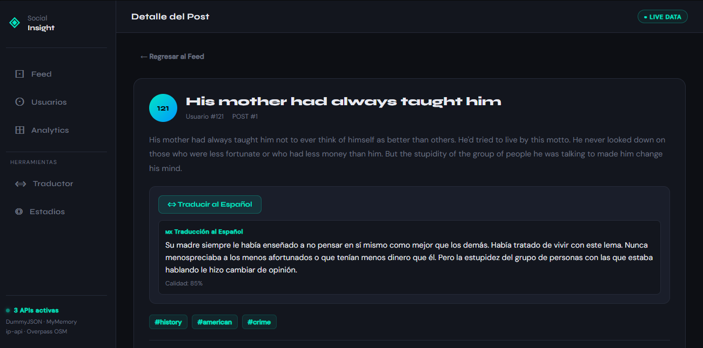
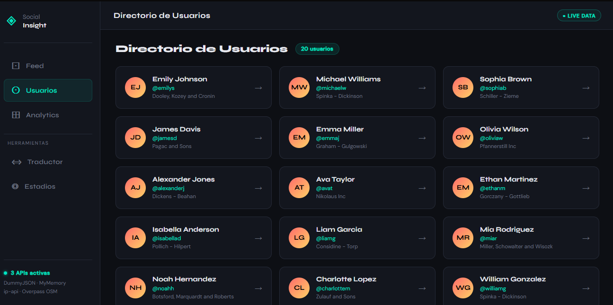
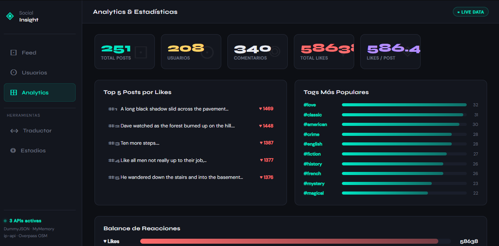
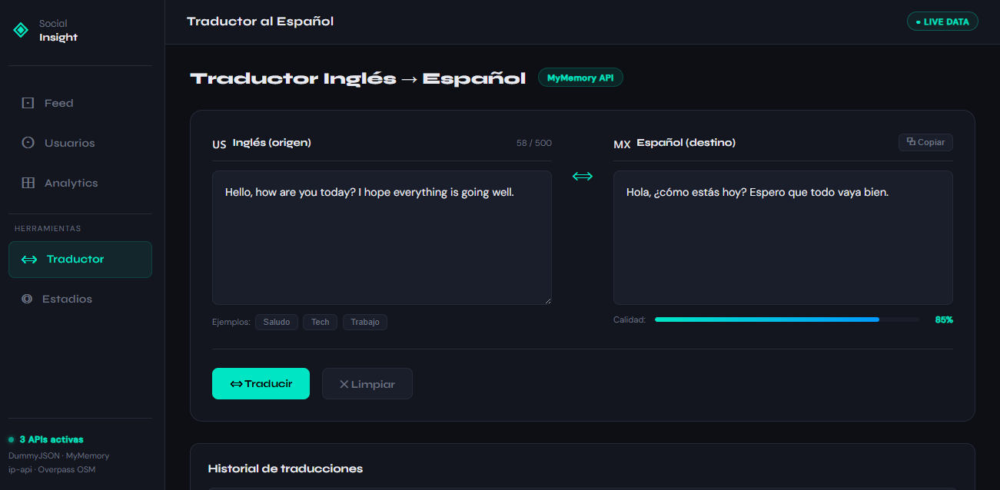
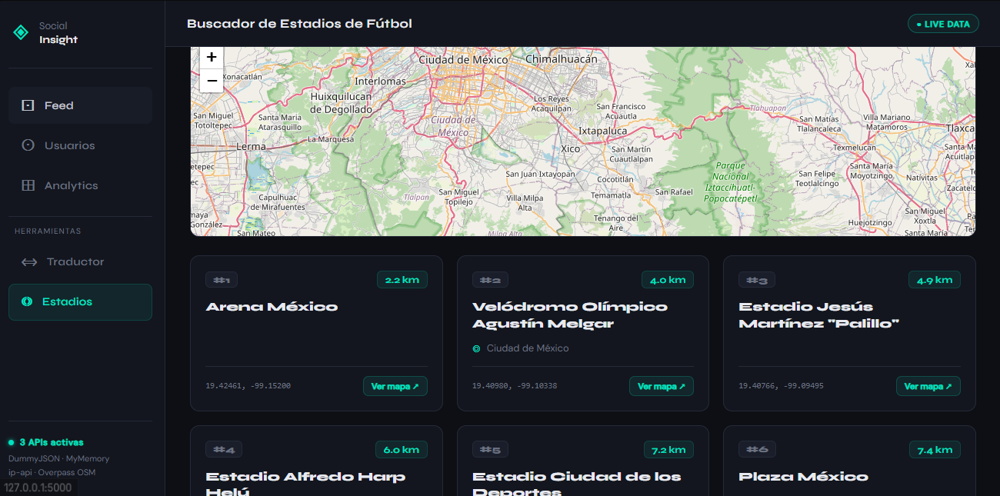
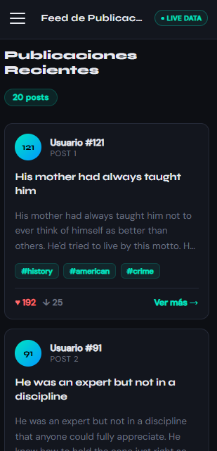

Readme · MD
Copiar

<div align="center">

# ◈ Social Insight Pro

**Aplicación web moderna desarrollada con Python + Flask que integra múltiples APIs públicas para explorar redes sociales, traducir texto y localizar estadios de fútbol en el mundo real.**

<br/>

[](https://python.org)
[](https://flask.palletsprojects.com)
[](https://developer.mozilla.org/es/docs/Web/CSS)
[]()
[]()

<br/>

> 🎓 Proyecto académico — Desarrollo Web con Python · Flask · APIs Públicas

</div>

---

## 📋 Tabla de Contenidos

- [Vista General](#-vista-general)
- [Funcionalidades](#-funcionalidades)
- [APIs Integradas](#-apis-integradas)
- [Estructura del Proyecto](#-estructura-del-proyecto)
- [Instalación](#-instalación)
- [Uso](#-uso)
- [Rutas Disponibles](#-rutas-disponibles)
- [Capturas de Pantalla](#-capturas-de-pantalla)
- [Tecnologías](#-tecnologías)
- [Uso de IA en el Desarrollo](#-uso-de-ia-en-el-desarrollo)
- [Decisiones Técnicas](#-decisiones-técnicas)
- [Autor](#-autor)

---

## 🌐 Vista General

**Social Insight Pro** es una plataforma web que demuestra la integración de APIs públicas reales dentro de una arquitectura Flask profesional. Cuenta con diseño **dark mode**, navegación lateral responsiva con menú hamburguesa, y cinco secciones funcionales completamente independientes.

```
◈ Social Insight Pro
│
├── ⊡  Feed           →  Publicaciones tipo red social con likes y comentarios
├── ⊙  Usuarios       →  Directorio de perfiles con detalle individual
├── ⊞  Analytics      →  Dashboard de KPIs, gráficos de barras y estadísticas
├── ⟺  Traductor      →  Traduce texto inglés → español con historial
└── ◎  Estadios       →  Busca estadios de fútbol reales por geolocalización
```

---

## ✨ Funcionalidades

| Sección | Descripción | API |
|:---:|:---|:---:|
| **Feed** | Publicaciones con avatar, tags, likes y dislikes. Cada card lleva al detalle completo | DummyJSON |
| **Detalle de Post** | Cuerpo completo, comentarios con likes y botón de **traducción inline** integrado | DummyJSON + MyMemory |
| **Usuarios** | Directorio con avatar generado, empresa y handle. Perfil individual con todos sus posts | DummyJSON |
| **Analytics** | 5 KPIs en tiempo real, top 5 posts por likes, ranking de tags y balance de reacciones | DummyJSON |
| **Traductor** | Panel dual inglés/español, indicador de calidad, botón copiar e historial de sesión | MyMemory |
| **Estadios** | Detección automática por IP, búsqueda por ciudad, mapa embebido y hasta 20 resultados | ip-api + Overpass OSM |

---

## 🔌 APIs Integradas

### 1 · DummyJSON Social API
> Simula datos reales de una red social sin autenticación

```
Base URL  →  https://dummyjson.com
Auth      →  No requerida ✅
```

| Endpoint | Uso en el proyecto |
|:---|:---|
| `GET /posts?limit=20` | Feed principal |
| `GET /posts/{id}` | Detalle de publicación |
| `GET /posts/{id}/comments` | Comentarios del post |
| `GET /users?limit=20` | Directorio de usuarios |
| `GET /users/{id}` | Perfil individual |
| `GET /posts/user/{id}` | Posts de un usuario |

---

### 2 · MyMemory Translation API
> Motor de traducción colaborativo, el más grande del mundo

```
Base URL  →  https://api.mymemory.translated.net
Auth      →  No requerida ✅
Par       →  en|es  (inglés → español)
```

| Endpoint | Uso en el proyecto |
|:---|:---|
| `GET /get?q={texto}&langpair=en\|es` | Traducción completa con calidad |

**Características implementadas:**
- ✦ Indicador de porcentaje de calidad de traducción
- ✦ Historial de las últimas 5 traducciones en sesión
- ✦ Botón copiar al portapapeles
- ✦ Traducción inline en cada post del feed

---

### 3 · ip-api Geolocation
> Detecta la ubicación del usuario automáticamente por IP

```
Base URL  →  http://ip-api.com/json/
Auth      →  No requerida ✅
```

| Campo retornado | Uso |
|:---|:---|
| `lat` / `lon` | Centro de búsqueda de estadios |
| `city` / `region` / `country` | Mostrar ubicación detectada |

---

### 4 · Overpass API — OpenStreetMap
> Datos geográficos reales y actualizados del mundo entero

```
Base URL  →  https://overpass-api.de/api/interpreter
Auth      →  No requerida ✅
Lenguaje  →  Overpass QL
```

**Datos retornados por estadio:**
- ✦ Nombre oficial, coordenadas y distancia calculada (algoritmo Haversine)
- ✦ Capacidad, operador/club y ciudad
- ✦ Enlace directo a OpenStreetMap y sitio web oficial si existe

---

## 📁 Estructura del Proyecto

```
social-insight-pro/
│
├── 📄 app.py                    ← Aplicación Flask: 7 rutas + 2 endpoints JSON
├── 📄 requirements.txt          ← Dependencias: flask, requests
├── 📄 README.md                 ← Este archivo
├── 📄 .gitignore                ← Exclusiones: venv, __pycache__, .env
│
├── 📂 services/                 ← Capa de servicios (una API por archivo)
│   ├── 📄 __init__.py
│   ├── 📄 social_api.py         ← DummyJSON: posts, usuarios, estadísticas
│   ├── 📄 translate_api.py      ← MyMemory: traducción con calidad
│   └── 📄 stadiums_api.py       ← ip-api + Overpass: geolocalización y estadios
│
├── 📂 templates/                ← HTML con Jinja2 (herencia desde base.html)
│   ├── 📄 base.html             ← Layout: sidebar + topbar + hamburger JS
│   ├── 📄 index.html            ← Feed de publicaciones
│   ├── 📄 post.html             ← Detalle + comentarios + traducción inline
│   ├── 📄 user.html             ← Directorio y perfil de usuario
│   ├── 📄 stats.html            ← Dashboard de analytics
│   ├── 📄 translate.html        ← Traductor completo con historial
│   └── 📄 stadiums.html         ← Buscador con mapa embebido
│
└── 📂 static/
    └── 📂 css/
        └── 📄 style.css         ← Dark mode + CSS Grid + 4 breakpoints responsive
```

---

## ⚙️ Instalación

### Prerrequisitos

- Python **3.10** o superior
- pip
- Git
- Conexión a internet

### Paso a paso

**1. Clona el repositorio**
```bash
git clone https://github.com/TU-USUARIO/social-insight-pro.git
cd social-insight-pro
```

**2. Crea y activa el entorno virtual**
```bash
# Crear
python -m venv venv

# Windows
venv\Scripts\activate

# macOS / Linux
source venv/bin/activate
```

**3. Instala las dependencias**
```bash
pip install -r requirements.txt
```

**4. Ejecuta la aplicación**
```bash
python app.py
```

**5. Abre en el navegador**
```
http://127.0.0.1:5000
```

> **⚡ Nota:** Las 4 APIs son 100% gratuitas y no requieren ninguna clave de acceso. La aplicación funciona desde el primer `python app.py`.

---

## 🚀 Uso

### Buscar estadios de fútbol

```
1. Ir a  ◎ Estadios  en el sidebar
2. La app detecta tu ciudad automáticamente por IP
3. Escribe cualquier ciudad en el buscador (ej: Guadalajara, Madrid)
4. Ajusta el radio: 20 / 50 / 100 / 200 km
5. Haz click en  ⊞ Buscar
```

### Traducir un post

```
1. Desde el Feed haz click en  Ver más →  en cualquier card
2. En la página del post aparece el botón  ⟺ Traducir al Español
3. También puedes usar la sección  ⟺ Traductor  del sidebar
```

---

## 🗺️ Rutas Disponibles

| Método | Ruta | Tipo | Descripción |
|:---:|:---|:---:|:---|
| `GET` | `/` | Página | Feed principal |
| `GET` | `/post/<int:id>` | Página | Detalle de post + comentarios |
| `GET` | `/users` | Página | Directorio de usuarios |
| `GET` | `/user/<int:id>` | Página | Perfil individual |
| `GET` | `/stats` | Página | Dashboard de analytics |
| `GET` | `/translate` | Página | Traductor inglés → español |
| `POST` | `/api/translate` | JSON | Endpoint de traducción |
| `GET` | `/stadiums` | Página | Buscador de estadios |
| `GET` | `/api/stadiums` | JSON | Endpoint de estadios por ciudad |

---

## 📸 Capturas de Pantalla

### 🖥️ Feed Principal


### 📝 Detalle de Post con Traducción Inline


### 👥 Directorio de Usuarios


### 📊 Dashboard Analytics


### ⟺ Traductor Inglés → Español


### ◎ Estadios con Mapa Embebido


### 📱 Vista Responsiva — Móvil


---

## 🛠️ Tecnologías

### Backend

| Tecnología | Versión | Uso |
|:---|:---:|:---|
| Python | 3.10+ | Lenguaje principal |
| Flask | 3.x | Framework web, rutas y templates |
| Requests | 2.x | Consumo de APIs externas HTTP |
| Jinja2 | Incluido | Motor de templates HTML |

### Frontend

| Tecnología | Uso |
|:---|:---|
| HTML5 | Estructura semántica con herencia Jinja2 |
| CSS3 puro | Dark mode, variables CSS, Grid y Flexbox |
| JavaScript vanilla | Hamburger menu, Fetch API, historial |
| Google Fonts | Tipografías Syne + DM Sans |

### Responsive Design

| Breakpoint | Rango | Comportamiento |
|:---|:---|:---|
| Desktop | > 1024px | Sidebar fijo de 220px |
| Laptop | ≤ 1024px | Sidebar reducido a 200px |
| Tablet | ≤ 768px | Sidebar tipo drawer + hamburguesa |
| Móvil | ≤ 480px | 1 columna, layout apilado |
| Móvil XS | ≤ 360px | Espaciado mínimo optimizado |

---

## 🤖 Uso de IA en el Desarrollo

Este proyecto fue desarrollado con apoyo de **Claude (Anthropic)** como herramienta de asistencia en el proceso de aprendizaje.

### Qué generó la IA
- Estructura base de los archivos del proyecto
- Código inicial de los servicios de consumo de APIs
- Plantillas HTML con sistema de herencia Jinja2
- Hoja de estilos con variables CSS y animaciones

### Qué comprendí y analicé

```python
# Entendí el patrón de separación de responsabilidades:
# app.py solo maneja rutas — los servicios manejan cada API por separado

@app.route("/stadiums")               # 1. Flask recibe la petición
def stadiums_page():
    location = get_location_by_ip()   # 2. Servicio llama a ip-api
    stadiums = get_stadiums_near(..)  # 3. Servicio llama a Overpass API
    return render_template(...)       # 4. Flask renderiza el template HTML
```

- El flujo completo: `ruta → Python → servicio API → datos → Jinja2 → HTML`
- Cómo `render_template()` pasa variables de Python al HTML con `{{ variable }}`
- El algoritmo de **Haversine** para calcular distancias entre coordenadas
- La sintaxis de **Overpass QL** para filtrar estadios en OpenStreetMap
- Por qué usar `flex: 1` + `min-width: 0` para evitar overflow en grids CSS

### Qué decidí por cuenta propia

- ✅ Selección de las 4 APIs después de comparar alternativas disponibles
- ✅ Agregar el botón de traducción **inline** directamente en cada post
- ✅ Implementar el algoritmo **Haversine** en Python puro sin librerías externas
- ✅ Ordenar los estadios por distancia **ascendente** (el más cercano primero)
- ✅ Limitar el historial del traductor a **5 entradas** con JavaScript puro
- ✅ Cerrar el sidebar automáticamente al navegar entre secciones en móvil

---

## 💡 Decisiones Técnicas

<details>
<summary><strong>¿Por qué Flask y no Django?</strong></summary>
<br/>
Flask permite una estructura más sencilla para proyectos de este tamaño. No se necesita ORM, admin panel ni autenticación. Cada ruta se declara en 3 líneas y la separación de servicios queda explícita y fácil de entender para fines académicos.
</details>

<details>
<summary><strong>¿Por qué Overpass API y no Google Maps?</strong></summary>
<br/>
Google Maps Platform requiere tarjeta de crédito y tiene límites de peticiones. Overpass API es completamente gratuita, sin registro, y los datos de OpenStreetMap son actualizados por millones de contribuidores a nivel mundial. Para un proyecto académico es la opción técnicamente correcta.
</details>

<details>
<summary><strong>¿Por qué CSS puro sin Bootstrap ni Tailwind?</strong></summary>
<br/>
Para demostrar dominio de CSS moderno con variables (<code>--accent</code>, <code>--bg2</code>), Grid, Flexbox y media queries sin dependencias externas. El resultado es un archivo CSS completamente controlado, sin clases innecesarias y con menor peso de carga.
</details>

<details>
<summary><strong>¿Por qué separar los servicios en /services?</strong></summary>
<br/>
Principio de separación de responsabilidades: si la URL de una API cambia o su estructura JSON varía, solo se modifica un archivo sin tocar <code>app.py</code> ni los templates. También facilita pruebas unitarias en el futuro.
</details>

<details>
<summary><strong>¿Por qué JavaScript vanilla sin React ni Vue?</strong></summary>
<br/>
Las interacciones del proyecto (menú hamburguesa, fetch de traducción, historial) son simples y no justifican cargar un framework completo. Vanilla JS mantiene el proyecto liviano y demuestra entendimiento del DOM nativo.
</details>

---

## 👤 Autor

<div align="center">

**Angel Gabriel Rojas Hernandez**

*Estudiante de Desarrollo Web · Licenciatura*

[](https://github.com/Deibo60)

</div>

<br/>

| Campo | Dato |
|:---|:---|
| **Nombre** | Gabriel Rojas |
| **Matrícula** | 1224100712 |
| **Institución** | UTNG |
| **Materia** | Aplicacines web orientadas a servicios |
| **Cuatrimestre** | 5 |
| **Docente** | Jose de Jesus Eduardo Barrientos Avalos |

---

## 📄 Licencia

```
MIT License — Copyright (c) 2025 TumbadoCT

Se concede permiso, de forma gratuita, a cualquier persona que obtenga
una copia de este software para utilizarlo sin restricciones, incluyendo
los derechos de usar, copiar, modificar, fusionar, publicar y distribuir.
```

---

<div align="center">

⭐ **Si este proyecto te fue útil, dale una estrella en GitHub** ⭐

<br/>

`Python` · `Flask` · `Jinja2` · `DummyJSON` · `MyMemory` · `OpenStreetMap` · `ip-api` · `CSS3` · `Responsive`

</div>
